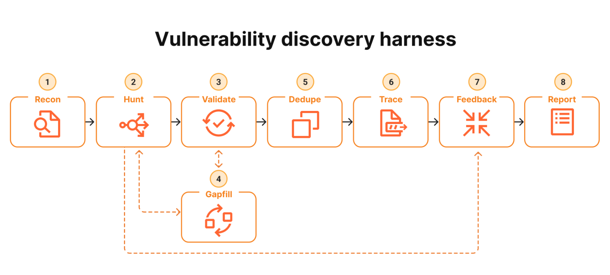

# codesec

An 8-stage vulnerability-discovery agent, built on the **Claude Code Agent
SDK**. Many narrow agents, deliberate disagreement, and an explicit
reachability gate.

**codesec is a fork of [evilsocket/audit](https://github.com/evilsocket/audit)**
that adds **first-class provider support** so you can run the whole pipeline
against:

- a **Claude Pro / Max** subscription (the upstream default), or
- the **Z.AI GLM Coding Plan**, or
- a **local Unsloth Studio** server (your own GPU / GGUF models).

MIT-licensed.

## Why the fork

`audit` is hard-wired to Anthropic. It *can* talk to any Anthropic-compatible
gateway, but only if you hand-set the right `ANTHROPIC_BASE_URL` /
`ANTHROPIC_AUTH_TOKEN` env vars and re-edit `config/stages.yaml` for every
model family. **z.ai and Unsloth both speak the Anthropic Messages API**
([z.ai](https://docs.z.ai/devpack/overview) at `https://api.z.ai/api/anthropic`,
[Unsloth](https://unsloth.ai/docs/basics/api) at `http://localhost:<port>`),
so both already work through that gateway path. codesec just makes them
first-class: one `--provider` flag picks the backend, resolves the right key,
points at the right URL, and re-maps every stage's model while preserving the
deliberate-disagreement opus/sonnet split.

| `--provider` | Base URL | Models | Billing |
|---|---|---|---|
| `anthropic` (default) | anthropic.com / gateway env | Claude family | Claude subscription / metered |
| `zai` | `https://api.z.ai/api/anthropic` | GLM-5.2 / GLM-4.7 | Z.AI GLM Coding Plan |
| `unsloth` | `http://localhost:8888` (configurable) | any loaded GGUF | your own hardware |

## Origin

The pipeline is a from-scratch reimplementation of Cloudflare's
[Project Glasswing](https://blog.cloudflare.com/cyber-frontier-models/) post,
which tested Anthropic's Mythos preview LLM against Cloudflare's own codebase.
The blog argues that real-world vulnerability discovery does **not** come from
asking one big model "find bugs here" — it comes from:

1. **Many narrow agents** working in parallel on tightly-scoped questions
   ("Look for command injection in this specific function, with this trust
   boundary above it") rather than one exhaustive agent.
2. **Deliberate disagreement** — a second agent, on a different model, that
   tries to *disprove* the first agent's findings.
3. **A reachability trace** as the gating step — most "is this code buggy?"
   findings are noise unless an attacker-controlled input can actually reach
   the sink from outside the system.
4. **A feedback loop** so reachable bugs in one place automatically seed
   hunts for the same pattern elsewhere.

The Cloudflare post showed the architecture; the upstream `audit` repo ships
the prompts, schemas, state store, and orchestrator; codesec adds portable
providers.

## The 8 stages



<sub>Diagram from Cloudflare's [Project Glasswing](https://blog.cloudflare.com/cyber-frontier-models/) post, reproduced here for reference.</sub>

| # | Stage    | Role (model family) | Purpose |
|---|----------|---------------------|---------|
| 1 | Recon    | opus  | Map the repo, emit narrowly-scoped Hunt tasks |
| 2 | Hunt     | sonnet | One attack class per agent; compile/run PoCs |
| 3 | Validate | opus  | Adversarial review panel + arbiter; tries to **disprove** (different model from Hunt) |
| 4 | Gapfill  | sonnet | Re-queue under-covered areas |
| 5 | Dedupe   | sonnet | Cluster findings by root cause |
| 6 | Trace    | opus  | Prove attacker-controlled input reaches the sink |
| 7 | Feedback | sonnet | Turn reachable traces into new Hunt tasks |
| 8 | Report   | sonnet | Schema-validated structured report |

Each stage is one markdown prompt in `prompts/` + one JSON Schema in
`schemas/`. The orchestrator passes the schema into the system prompt so
every output is shape-stable on the first try. Stages are tagged by **role**
(opus / sonnet); `--provider` swaps the whole model family while keeping the
validate≠hunt disagreement intact.

Validate runs as a **panel**: `validate.rounds` independent adversarial
reviews per finding (later rounds see the earlier verdicts' cruxes and are
told to attack the angles the panel hasn't covered), then an arbiter rules
on the evidence. With `rounds > 1` the stored `validator_confidence` is the
fraction of panel+arbiter votes agreeing with the final call — an ensemble
signal, not a self-report. `rounds: 1` restores the classic single pass.

## Quickstart

```bash
# 1. Install
python -m venv .venv && source .venv/bin/activate
pip install -e .

# 2. Pick a provider and verify auth
codesec providers                       # list presets
codesec auth-check                      # default: Claude subscription / API / gateway
codesec auth-check --provider zai       # Z.AI GLM Coding Plan
codesec auth-check --provider unsloth   # local Unsloth Studio

# 3. Run
codesec run --repo /path/to/target --run-id my-run
codesec status --run-id my-run
codesec report --run-id my-run --format md > report.md
```

## Local models — direct engine (recommended over the SDK for local LLMs)

For local models the Claude Code Agent SDK is the wrong tool: it spawns a
subprocess per turn and prepends a per-request **attribution header that
thrashes llama-server's KV cache** (Unsloth's own docs call this a ~90%
slowdown), and it advertises the full Claude Code toolset, which trips
llama-server's tool-grammar compiler on hybrid/SSM models.

`--engine local` drops all of that. codesec talks **directly** to a
llama-server `/v1/chat/completions` endpoint with a hand-rolled
Read/Grep/Glob/Bash loop:

- no `claude` subprocess, no claude login,
- append-only message history → **prefix KV cache hits on turn 2+** (the big
  multi-turn win),
- only 4 tools advertised → grammar compiles cleanly, **no proxy**,
- full control over sampling / max_tokens / thinking.

The implementation roadmap for the recall-first Titus discovery model plus
OpenMythos validation/tracing is documented in the
[Titus + OpenMythos optimization plan](docs/titus-openmythos-optimization-plan.md).

### Titus + OpenMythos duo pipeline

`duo-v1` batches all Titus work before OpenMythos, uses conservative
deterministic exact dedupe, and assembles the final report and review queue in
code. It keeps every run's database, results, scratch files, logs, and runtime
manifest under one isolated run root.

For one NVIDIA GPU, point the two model-path variables at the pinned GGUFs and
let codesec own one `llama-server` process at a time:

```bash
export CODESEC_TITUS_GGUF=/models/Titus-CybersecurityLLM-v1.0.Q4_K_M.gguf
export CODESEC_OPENMYTHOS_GGUF=/models/OpenMythos-27B-Q6_K.gguf
export CODESEC_LLAMA_SERVER=/path/to/llama-server

codesec run --repo /path/to/target \
  --pipeline duo-v1 --runtime managed \
  --run-id duo-001 --run-root ./runs/duo-001
```

The managed runtime requests full GPU offload, verifies substantial VRAM
allocation through `nvidia-smi`, records both model hashes and exact server
commands, then stops Titus before loading OpenMythos. For two GPUs or
operator-managed servers, expose the aliases and endpoints in
`config/duo-v1.yaml` and use `--runtime external`.

```bash
codesec run --repo /path/to/target \
  --pipeline duo-v1 --runtime external \
  --run-id duo-002 --run-root ./runs/duo-002

codesec status --run-id duo-002 --run-root ./runs/duo-002
codesec report --run-id duo-002 --run-root ./runs/duo-002 --format md
python -m bench.score_repo ./runs/duo-002 \
  bench/corpus/manifests/devshop.json --stages
```

This path is currently benchmark/experimental hardening, not a fully
sandboxed production scanner: repository writes are path-restricted, but the
agent Bash tool still needs an OS-level sandbox before scanning hostile code
in production.

Verified against `run-qwopus.sh` (raw llama.cpp, Qwopus3.6-27B Q3_K_M, 64K):
22-27 tok/s decode and **84-97% prompt cache reuse** from turn 2 — ~3× the
Unsloth+SDK path.

```bash
# 1. serve the model (raw llama.cpp = fastest; Unsloth works too)
llama-server -m /path/to/model.gguf --port 8080 --alias qwopus-27b &
# or: unsloth run --model <gguf> --disable-tools --api-only --port 8888

# 2. codesec, direct — no SDK, no proxy
codesec run --repo /path/to/target --engine local \
  --base-url http://localhost:8080 --model qwopus-27b \
  --max-concurrency 1 --max-recon-tasks 15
```

The local engine is provider-agnostic: point `--base-url` at any
OpenAI-compatible `/v1/chat/completions` (llama-server, Unsloth, vLLM, Ollama
with the compat layer). For the SDK path (Claude/z.ai subscriptions) leave
`--engine` at its default.

### Hosted OpenAI-compatible APIs (Hetzner Inference, etc.)

Any hosted OpenAI-compatible endpoint works too, e.g. Hetzner's
(`https://inference.hetzner.com`):

```bash
export HETZNER_API_KEY=<token>   # inference console → API tokens
codesec run --repo /path/to/target --config config/hetzner.yaml
# or ad-hoc, no config file:
codesec run --repo /path/to/target --engine local \
  --base-url https://inference.hetzner.com/api/v1 \
  --model Qwen3.8-27B --max-concurrency 4
```

The key comes from `HETZNER_API_KEY` (config path) or `CODESEC_API_KEY`
(ad-hoc path). Edit the single `model:` line in `config/hetzner.yaml` to
switch models; `GET /api/v1/models` lists what the token can serve.

## Providers

Run `codesec providers` to see all presets, or read `.env.example`.

### Z.AI GLM Coding Plan (`--provider zai`)

[GLM Coding Plan](https://docs.z.ai/devpack/overview) is a subscription that
exposes the GLM family through an **Anthropic-compatible endpoint**, so it
drops straight into the Claude Code Agent SDK. codesec maps stages
automatically:

- opus-role stages (recon / validate / trace) → **`glm-5.2`** (Z.AI's flagship, Opus-tier)
- sonnet-role stages (hunt / gapfill / dedupe / feedback / report) → **`glm-4.7`**

So Validate (`glm-5.2`) still disagrees with Hunt (`glm-4.7`).

```bash
export ZAI_API_KEY=<key from https://z.ai/manage-apikey/apikey-list>
codesec auth-check --provider zai
codesec run --repo /path/to/target --provider zai --max-cost-usd 30
```

Or put `CODESEC_PROVIDER=zai` + `ZAI_API_KEY=` in `.env` and drop the flags.

### Unsloth Studio (`--provider unsloth`)

[Unsloth](https://unsloth.ai/docs/basics/api) serves any loaded GGUF model
through an Anthropic-compatible `POST /v1/messages`. It's local inference on
your own hardware. Because only **one** model is loaded at a time, pass
`--model` (the exact id from `GET /v1/models`) — this collapses
deliberate-disagreement to a single model, so accept lower recall on
adversarial validation.

```bash
# Start Unsloth Studio, load a GGUF, create an sk-unsloth-... key, then:
export UNSLOTH_API_KEY=sk-unsloth-...
codesec auth-check --provider unsloth --model unsloth/gemma-4-26B-A4B-it-GGUF
codesec run --repo /path/to/target --provider unsloth \
  --model unsloth/gemma-4-26B-A4B-it-GGUF \
  --base-url http://localhost:8888
```

#### Hybrid/SSM models + the tool-grammar workaround

llama-server (Unsloth's backend) can't compile a tool-calling grammar over the
**full Claude Code toolset** your install advertises (built-ins **plus** every
extension/MCP/GSD tool — often 25-30 tools) for some models, notably
hybrid/SSM Qwen (e.g. `Qwopus3.6-27B`), so a direct run 400s every turn.
`ClaudeAgentOptions.tools` only restricts built-ins, so codesec ships a sidecar
that strips the advertised toolset down to the four stages actually use
(`Read, Grep, Glob, Bash`) — which compiles cleanly:

```bash
# terminal 1: Unsloth serving the model on :8888
# terminal 2: the codesec tool-stripping proxy
codesec unsloth-proxy --upstream http://localhost:8888 --port 9999 &
# terminal 3: codesec -> proxy -> Unsloth
codesec run --repo /path/to/target --provider unsloth \
  --model Qwopus3.6-27B-v2-MTP-Q3_K_M --base-url http://localhost:9999
```

This makes hybrid Qwen3 run the full pipeline (verified: recon completes,
advances to hunt). Revisit once Unsloth ships a llama.cpp that handles large
toolsets in the grammar compiler.

### Anthropic (default)

Unchanged from upstream. The auth module picks one of four modes, in order:

1. **LLM gateway** (OpenRouter, custom proxy) — `ANTHROPIC_BASE_URL` away
   from anthropic.com AND `ANTHROPIC_AUTH_TOKEN` set.
2. **Subscription OAuth (headless)** — `CLAUDE_CODE_OAUTH_TOKEN` from
   `claude setup-token`. Best for CI.
3. **Subscription OAuth (interactive)** — `~/.claude/.credentials.json`
   from `claude login`. Best for local dev.
4. **Metered API key** — `ANTHROPIC_API_KEY`, opt in with
   `--allow-api-key` (or `CODESEC_ALLOW_API_KEY=1`).

See upstream's [auth docs](https://code.claude.com/docs/en/authentication).

## Cost containment

A real production codebase can produce 15–50 Hunt tasks and 25+ findings to
validate. At default concurrency this gets expensive (and on
subscription-capped plans like Z.AI, you'll hit the 5-hour window). Flags to
keep it sane:

```bash
codesec run --repo /path/to/target \
  --max-concurrency 1 \           # one agent subprocess at a time
  --max-recon-tasks 15 \          # cap initial Hunt fanout
  --max-cost-usd 30               # abort cleanly if exceeded (Anthropic only)
```

The budget guard fires between *and* within stages — a per-task check in
Hunt cooperatively aborts rather than running 30 more tasks past the cap.

## Live-target reproduction (optional)

If the target has a running deployment, point the agents at it. Hunt then
**reproduces** each finding against the live service instead of compiling a
local PoC, Validate **rejects** findings that don't reproduce, and Trace
**confirms** reachability with real HTTP round-trips.

```bash
codesec run --repo /path/to/target --run-id live \
  --max-concurrency 1 \
  --target-url http://server.local:8888 \
  --target-creds email=admin@system.com --target-creds password=changechangeme
```

## Scope notes (optional)

Drop intentionally-loose-by-design surfaces (plaintext API keys that are a
feature, test-only endpoints, etc.) in a text file:

```bash
codesec run --repo /path/to/target --scope-notes target_scope.md
```

## Layout

```
prompts/        8 stage prompts (markdown, loaded as system prompts)
schemas/        9 JSON schemas — every agent output is validated
config/         stages.yaml — per-stage model role + concurrency + tools
codesec/        Python package (renamed from upstream's audit/)
  cli.py        Click CLI — run / status / report / providers / auth-check / unsloth-proxy
  providers.py  ★ z.ai / unsloth / anthropic presets (--provider)
  auth.py       OAuth/gateway/API-key check (provider-aware)
  config.py     per-stage config + provider model-mapping
  runner.py     claude-agent-sdk wrapper with schema validation + repair turn
  local_agent.py ★ direct OpenAI-compatible client for local LLMs (--engine local)
  orchestrator.py pipeline driver
  contracts.py  ★ semantic stage postconditions JSON Schema can't express
  run_paths.py  ★ isolated run-root layout (--run-root / duo-v1)
  runtime.py    ★ managed/external llama.cpp lifecycle (--runtime / duo-v1)
  unsloth_proxy.py ★ tool-stripping sidecar for local llama-server backends
  json_utils.py robust JSON extraction + schema validation
  state.py      SQLite DAO (runs, tasks, findings, traces, dedupe, costs)
  stages/       one module per stage
work/           per-Hunt-task scratch dirs (sandbox for PoC compile/run)
results/        JSONL artifacts per stage + final report.json (legacy pipeline)
runs/           isolated run roots for duo-v1 (--run-root; one state.db per run)
state.db        legacy shared SQLite (gitignored)
```

## Safety

Hunt agents have Bash and run inside per-task scratch dirs. They are **not**
sandboxed at the OS level. Run the audit inside a disposable VM or container
when you don't trust the target source — a target with malicious build
scripts could otherwise execute on your host during PoC compilation.

The agent reads everything you point it at, including any `.env` or
`secrets/` directories in the target. Outputs land in `results/<run-id>/`
which is `.gitignore`d but **not** scrubbed of those reads.

## Differences from upstream `evilsocket/audit`

- Package renamed `audit` → `codesec`; console script `audit` → `codesec`.
- New `codesec/providers.py` + `--provider` / `--api-key` / `--base-url` /
  `--model` flags on `run` and `auth-check`; new `codesec providers` command.
- `config.apply_provider_models()` re-maps stage models per provider by role.
- `configure_auth()` is provider-aware; `AuthStatus.provider` reports it.
- `runner.py` sets `ClaudeAgentOptions.tools` explicitly (not just `allowed_tools`) so non-Anthropic gateways don't get the full Claude Code toolset advertised.
- `local_agent.py` + `--engine local`: direct OpenAI-compatible client to llama-server with hand-rolled Read/Grep/Glob/Bash — no Claude SDK, no subprocess, KV-cache-friendly multi-turn. The optimized path for local models.
- `codesec unsloth-proxy` + `codesec/unsloth_proxy.py`: sidecar that strips the advertised toolset so hybrid/SSM models (e.g. Qwopus) work through llama-server (only needed if you keep `--engine sdk` with a local model).
- Env var `AUDIT_ALLOW_API_KEY` renamed to `CODESEC_ALLOW_API_KEY` (the old
  name is still read, for ported configs).
- Everything else — prompts, schemas, orchestrator, runner, state DB — is
  unchanged from upstream, so behavior and report quality are identical when
  `--provider anthropic` (the default).

## License

[MIT](LICENSE). Reuse freely. No warranty.

## Acknowledgements

- Pipeline design: Cloudflare's [Project Glasswing](https://blog.cloudflare.com/cyber-frontier-models/).
- Original implementation: [evilsocket/audit](https://github.com/evilsocket/audit).
- Built on the official [Claude Code Agent SDK](https://code.claude.com/docs/en/agent-sdk/overview).
- Provider docs: [Z.AI GLM Coding Plan](https://docs.z.ai/devpack/overview),
  [Unsloth API](https://unsloth.ai/docs/basics/api).
